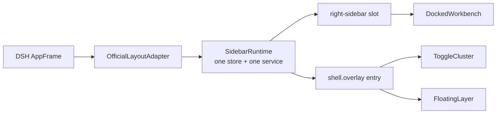

# Spec: 合并 better-sidebar upstream v0.16.1

状态：已批准并按本规格实施。

## 目标

把 upstream `v0.16.1` 的功能吸收到本地官方布局分支，同时保持 DSH 对外层布局的唯一所有权。

基线固定如下：

- upstream：commit `f9153df`，tag `v0.16.1`。
- local：commit `a97b062`。
- merge-base：commit `6c89151`。
- 实施分支：`codex/merge-upstream-v0161`。

本变更吸收 Side Chat、`sidebar_open`、FreeWindow、Markdown HTML/TOC、Open With、多语言、Git 修复和桌面兼容能力。它保留本地官方 `right-sidebar`、`shell.overlay`、`ctx.layout` 接入和原生文件搜索降级链。

本变更不修改、复制或提交 DSH 官方源码。

## 成功标准和边界

### 成功标准

- DSH `ctx.layout` 是右栏开合和外层几何的唯一真相源。
- `right-sidebar` slot 只承载 docked workbench。
- 一个 `shell.overlay` entry 同时承载 `ToggleCluster` 和 viewport 级 `FloatingLayer`。
- 插件只有一个 activation-local runtime、store 和 service。两个 React surface 共享这些对象，不复制状态或副作用。
- 插件不创建 body 级 React root，不写 `#root` margin，也不写宿主右栏宽高变量。
- 关闭官方右栏后，已存在的 FreeWindow 仍可见、可移动、可缩放、可 raise、可 dock 和可关闭。
- active session 中 path/url 最终落在 docked tab 时，创建和去重命中都展开官方右栏；最终落在 float 时只 raise。
- inactive session targeted open 和普通 type-only open 不改变当前宿主布局。
- Subagent、Jobs 和 topology 跳转显式请求展开官方右栏。
- 外部 provider 禁用 UI 时，docked 和 overlay surface 原子卸载；service 继续发布，但 reveal 不得打开空右栏。
- upstream v0.16.1 的功能、本地文件搜索和消费者 API 通过单元、类型、构建和真实挂载验证。
- 合并提交包含 upstream `f9153df` 的历史，且不存在未解决冲突。

### 非目标

- 不保留 upstream 的 body panel host、外层 resize handle 或 layout-push 实现。
- 不复制 DSH AppFrame、slot 或 layout service 的实现。
- 不新增第二套 panel open/width 真相源。
- 不改变 Side Chat、`sidebar_open`、settings、file、PTY 或 job 的 HTTP/WS 路径。
- 不删除或重命名 `ctx.betterSidebar` 的已有公共字段。
- 不在本变更中发布 npm 包、创建 tag、推送远程分支或修改 DSH 主包。
- 不承诺从持久化的 `SidebarState.width` 恢复宿主宽度。DSH 公共 API 没有设置右栏宽度的方法。

### 兼容与许可边界

- 本地和 upstream 都使用 MIT 许可证。合并时保留根 `LICENSE` 的版权和许可文本。
- `@vscode/ripgrep` 继续作为依赖使用，并保留其分发许可材料。
- 可以直接合并同一项目的 upstream 实现，不要求 clean-room 重写。
- 对 DSH 只调用公开的 slot 和 layout API。不得把 `/home/cai/dev/deepseek-harness` 的实现复制进插件。

### 能力处置表

| 能力或组件 | 处置 | 约束 |
| --- | --- | --- |
| DSH `ctx.layout`、`right-sidebar`、`shell.overlay` | 调用 | 宿主拥有外层几何；插件只注册 surface 和发送开合意图 |
| upstream Sidebar/workbench | 吸收并改写接入 | 保留 tab 树、bottom workbench 和内容；删除自管右 panel 壳 |
| upstream FreeWindow state/reducers | 吸收 | 保留 float/dock/raise/move/resize/close 和持久化语义 |
| `FloatingLayer`、`ToggleCluster` | 重写 surface | 同一个 overlay entry；wrapper click-through，交互节点 `pointer-events: auto` |
| upstream body panel host、layout-push、corner handles | 舍弃 | 不允许成为降级路径 |
| `SidebarState.panelOpen`、`width` | 保留为兼容投影 | 不直接写 DOM 或宿主宽度 |
| `BetterSidebarService.openTab` | 吸收并适配 | 根据 reducer 后的最终落点决定 reveal |
| Side Chat 和 `sidebar_open` | 吸收并适配 | 保留 session/trust fence；client delivery 走同一 runtime |
| desktop env、WCO、preset、title strip | 吸收并限制 | 只调整插件 chrome，不取得宿主几何所有权 |
| 本地 file search | 保留并增量吸收 | 加入 upstream noise-dir 规则，所有 engine 语义一致 |
| manifest、文档和 CI | 合并 | upstream `0.16.1` 为功能基线；保留本地注入、ripgrep 和挂载测试 |

## User Stories

- 用户拖动 DSH 官方右栏 handle 时，宿主列宽和会话区域同步变化，插件内容跟随 occupant 尺寸。
- 用户关闭官方右栏后，已拖出的浮窗继续留在 frame 上方并保持交互。
- 用户把浮窗 dock 回右栏时，官方右栏自动展开并显示该 tab。
- 用户再次打开已经存在的 docked 文件或 URL 时，系统去重并展开右栏。
- 用户再次打开已经存在的 floating 文件或 URL 时，系统只 raise 浮窗。
- 用户切换会话时，每个会话保留自己的 tab、float 和期望开合状态，不让旧会话的异步回调污染新会话。
- 用户可以创建 Side Chat，并让模型通过 `sidebar_open` 打开当前会话中的文件、目录或 URL。
- 用户搜索文件时，系统按原生工具降级链工作，并在只剩 JS walker 时仍返回一致结果。
- 外部 provider 暂时接管 UI 时，消费插件仍可注册和更新状态；重新启用后 UI 从现有状态恢复。

## 解决方案

### 顶层设计



`SidebarRuntime` 是非 React 的 activation-local owner。它创建并持有 store、`BetterSidebarService`、`OfficialLayoutAdapter`、session reconciliation 和 surface lifecycle。`DockedWorkbench` 与 overlay 是两个 React root，但接收同一组 runtime 对象。

会修改状态、订阅 session 或触发自动打开的生命周期只注册一次。`FloatingLayer` 不重复注册 Subagent、Jobs、topology、清理或持久化副作用。

#### DockedWorkbench

`right-sidebar` 是 root-scoped single slot。其 owner props 为 `{ collapsed, width }`。

`DockedWorkbench` 包含 upstream 的 tab tree、内容区和 bottom workbench。bottom workbench 仍是右栏内部的垂直分区，不覆盖中心会话区域，也不写宿主外层几何。

occupant 使用宿主提供的可用尺寸。它可以在 collapsed 时停止 docked 内容交互，但不得包含 FreeWindow。

#### OverlaySurface

`shell.overlay` 是 frame-wide、位于滚动容器外的 additive layer。插件只注册一个稳定 id 的 entry，该 entry 渲染 `ToggleCluster` 和 `FloatingLayer`。

`FloatingLayer` 满足以下约束：

- viewport containing block 使用 `position: fixed; inset: 0` 或经真实宿主测试证明等价的 frame-wide 定位。
- wrapper 使用 `pointer-events: none`。
- 每个 FreeWindow 和 toggle 交互节点恢复 `pointer-events: auto`。
- 不调用 `createPortal(..., document.body)`。
- 不成为 `DockedWorkbench` 或 collapsed occupant 的后代。
- overlay 与 docked surface 共享 store、service、session scope 和 z-order state。

#### OfficialLayoutAdapter 与状态协调

宿主实际状态来自两个来源：

- `ctx.layout.snapshot` 提供 `mode`、`mobileSurface`、`detailsAvailable` 和 `rightSidebarAvailable`。
- `right-sidebar` owner props 提供当前 `collapsed` 和 `width`。

`SidebarState.panelOpen` 和 `SidebarState.width` 继续存在，以保持 upstream 状态形状和持久化兼容。它们只是每个 session 的期望值或观测投影：

1. 初次挂载或 active session 改变时，adapter 读取该 session 的 `panelOpen`，调用 `openRightSidebar()` 或 `closeRightSidebar()`。
2. adapter 记录 session epoch 和预期的 `collapsed` acknowledgement。旧 epoch 的 owner callback 不得写入新 session。
3. owner 的 `collapsed` 与当前 pending intent 匹配后，adapter 清除 pending intent，并把实际值投影回当前 session。
4. 没有 pending intent 时，owner 的 `collapsed` 变化视为用户或宿主操作，并投影到当前 session。
5. owner 的 `width` 只做去抖投影，不调用插件 CSS 或宿主私有接口写回。
6. 初始 owner props 不得覆盖尚未完成的 `openByDefault` 或 session restore intent。

adapter 对相同目标值的调用必须幂等，并用 equality guard 防止 host → store → host 循环。

DSH 当前没有公开的 `setRightSidebarWidth`。因此 reload 或 session switch 后的真实宽度以宿主值为准；持久化的 `SidebarState.width` 只供兼容消费者读取。这是已接受的兼容限制。

#### Reveal policy

reveal 根据 reducer 完成后的最终 tab 落点判断，不只根据输入 seed 或“是否新建”判断。

| 场景 | 更新状态 | 展开官方右栏 |
| --- | --- | --- |
| active session，新 path/url 最终落在 docked | 是 | 是 |
| active session，去重命中 docked path/url | 是，激活既有 tab | 是 |
| active session，命中 floating tab | 是，raise float | 否 |
| inactive session targeted path/url open | 是，写目标 session | 否 |
| 普通 type-only open | 是 | 否 |
| float dock 回 pane | 是 | 是 |
| Subagent、Jobs、topology 明确导航 | 是 | 是 |
| UI suspended 或 layout unavailable | 是 | 否 |

host reveal 在 reducer 提交之后调用。相同状态上的重复 reveal 可以发生，但必须对 DSH 幂等。

#### Suspend 与激活生命周期

外部 provider 接管时，better-sidebar 进入 `suspended`，不是完整 plugin unload：

- `right-sidebar` 和唯一 `shell.overlay` entry 由同一 lifecycle 原子注销。
- store、service、tab/viewer registrations、host routes 和 agent-open delivery 保留。
- `openTab` 和 tool delivery 可以更新目标 session 的隐藏状态，但 adapter 的 reveal 是 no-op。
- suspended 期间不得注册空 occupant，不得调用 layout 打开一个没有贡献内容的右栏。
- 重新启用时原子挂回两个 surface，并对 active session 执行一次 reconciliation。
- dispose、HMR 和重复激活使用 generation token；旧 generation 的异步结果不得重新挂载或 reveal。

这样可以避免永久排队，也不要求消费插件在短暂 UI 切换时重新注册。若 runtime 最终 dispose，现有 upstream 失败语义保持不变，不静默吞掉新请求。

#### Desktop compatibility

保留 upstream 的纯 `desktop-env.ts` parser、WCO 检测、shell preset、自定义 CSS 和 title-bar 设置。

这些能力只调整插件自身 chrome、title strip、safe area 和设置图标。以下行为禁止恢复：

- 写 `#root`、conversation 或 AppFrame 的 margin/width。
- 写 `--dsh-sidebar-width`、`--dsh-sidebar-height` 等外层几何变量。
- 挂载 upstream panel host 或自有外层 resize handle。

#### File search

保留本地自动链：`fd` → `fdfind` → packaged `rg` → PATH `rg` → JS walker。

吸收 upstream 的 noise-dir 排除集合，并把相同规则应用到 fd argv、rg globs 和 JS walker。继续保留缓存、ENOENT 后重新探测、`maxMatches`、`maxVisited` 和符号链接目录保护。

#### Manifest、文档和版本

- package 版本采用 upstream `0.16.1`。
- 合并 upstream 新增依赖、exports、routes、chunks 和 CI 覆盖。
- 保留本地 DSH layout token 注入、`@vscode/ripgrep` 和 `test:mount:fs-search`。
- README、README_EN 和 AGENTS 以 v0.16.1 能力为基底，补充官方布局、overlay、suspend 和宽度限制。
- upstream CI 使用的 DSH CLI pin 与插件 peer range 分开核对，不盲选任一分支的版本。

### 模块接口

#### OfficialLayoutAdapter

```ts
type SidebarUiState = 'initializing' | 'active' | 'suspended' | 'disposed'

interface OfficialLayoutAdapter {
  readonly state: SidebarUiState
  mountSurfaces(): void
  suspendSurfaces(): void
  revealDockedSurface(): void
  closeDockedSurface(): void
  toggleDockedSurface(): void
  reconcileSession(sessionId: string): void
  dispose(): void
}
```

接口不暴露宽度 setter。`mountSurfaces()` 在 active generation 中不得重复注册 slot。`suspendSurfaces()` 和 `dispose()` 可重复调用。开合方法在 `initializing`、`suspended`、`disposed`、layout unavailable 或 contribution unresolved 时是 no-op，并记录可诊断状态。

缺少必需的 `ctx.layout`、`right-sidebar` 或 `shell.overlay` 能力时显示可见 plugin error，不回退到 body portal。

#### BetterSidebar service host seam

```ts
interface BetterSidebarServiceHost {
  revealDockedSurface?: () => void
}

function createBetterSidebarService(
  store: SidebarStore,
  host?: BetterSidebarServiceHost,
): BetterSidebarService
```

该 seam 只接收最终 docked landing 的 reveal intent。它不参与 tab 去重、状态持久化或 float raise。host 缺省时 service 保持独立可测试。

现有 `BetterSidebarService` 公共字段不删除、不重命名。新增内部 seam 不向消费者暴露 `ctx.layout` 或 slot owner。

#### DSH layout shape

```ts
interface RightSidebarOwnerProps {
  readonly collapsed: boolean
  readonly width: number
}

interface SidebarLayoutSnapshot {
  readonly mode: 'desktop' | 'mobile'
  readonly mobileSurface: 'sidebar' | 'details' | 'right-sidebar' | null
  readonly detailsAvailable: boolean
  readonly rightSidebarAvailable: boolean
}

interface SidebarLayoutService {
  readonly snapshot: {
    getSnapshot(): SidebarLayoutSnapshot
    subscribe(listener: () => void): () => void
  }
  openRightSidebar(): void
  closeRightSidebar(): void
  toggleRightSidebar(): void
}
```

类型以目标 DSH 公共声明为准。不得添加宿主不存在的 width setter，也不得恢复与 host/client 类型冲突的 module augmentation。

#### File search seam

```ts
type FsSearchEngine = 'fd' | 'fdfind' | 'packaged-rg' | 'path-rg' | 'js'

interface FsSearchOptions {
  maxMatches?: number
  maxVisited?: number
  engine?: 'auto' | 'fd' | 'rg' | 'js'
  runCommand?: RunCommand
  resolvePackagedRg?: () => Promise<string | null>
  onEngineSelected?: (engine: FsSearchEngine) => void
}

interface FsSearchResult {
  matches: string[]
  truncated: boolean
}
```

接口保持本地现状。upstream noise-dir 规则不得改变 engine 的公开枚举或 fallback 顺序。

### 数据库 Schema 变更

无数据库 Schema 变更。

继续使用 upstream 现有 session 事件、Side Chat 持久化和 localStorage sidebar state。反序列化时对 floats、坐标和尺寸执行现有 sanitization。

`panelOpen` 和 `width` 不迁移或删除。它们改为兼容投影，不再代表宿主几何写权限。

### API 协议

不新增或修改 HTTP/WS 路径。以下 upstream 协议保持 v0.16.1 语义：

- `/sidebar/api/sidechat.start`
- `/sidebar/api/sidechat.prompt`
- `/sidebar/api/sidechat.cancel`
- `/sidebar/api/sidechat.dispose`
- `/sidebar/api/sidechat.info`
- `/sidebar/ws/agent-opens`
- 现有 settings、file、PTY 和 job routes

`sidebar_open` 保留调用方 session 隔离、path/scheme 校验、无订阅排队和 attach replay。client 收到有效请求后调用共享 service；是否 reveal 仍由最终落点矩阵决定。

### 冲突处理策略

固定基线的 `git merge-tree --write-tree a97b062 f9153df` 产生 14 个冲突路径。解决规则如下：

| 路径 | 解决方向 |
| --- | --- |
| `src/client/Sidebar.tsx` | 以上游 workbench 为基底，拆分 docked 与 floating surface；删除自管 panel host |
| `src/client/sidebar.module.css` | 保留 upstream FreeWindow 样式，改为 overlay containing block；保留本地 occupant 样式 |
| `src/client/layout.css` | 保留插件 chrome/WCO 规则；拒绝 root margin、旧宽高变量和 layout push |
| `src/client/desktop-env.ts`、`tests/desktop-env.spec.ts` | 接受 upstream 纯环境 parser 及其测试，不加入几何写入 |
| `src/context-types.ts` | 以上游服务类型为基底，补回目标 DSH 的公开 layout shape |
| `src/fs-search.ts` | 保留本地 native fallback，吸收 upstream noise-dir 规则 |
| `tests/e2e/drag-layout.e2e.ts` | 改成官方 handle、零 root margin 和 float-collapse 契约 |
| `tests/e2e/mount.e2e.ts`、`tests/sidebar-crash.spec.tsx` | 合并 upstream 功能卷与本地官方挂载卷 |
| `README.md`、`README_EN.md`、`AGENTS.md` | 以 0.16.1 文档为基底，写明官方 surface 架构和限制 |
| `docs/plans/2026-08-19-sidebar-injection-unified-host-design.md` | 保持本地删除；本规格取代旧设计文档 |

`package.json`、lockfile、client entry 和其他自动合并文件也必须按本规格审计，不能因为 Git 没报告冲突就直接接受。

### 失败矩阵

| 失败点 | 触发条件 | 预期表现 | 验证或恢复 |
| --- | --- | --- | --- |
| layout 或必需 slot 缺失 | 目标 DSH 不提供公开能力 | 显示 plugin error；不挂 body portal | 修正 DSH 版本或停止挂载 |
| duplicate activation/HMR | 两个 generation 重叠 | 只存在一个 occupant 和一个 overlay id | generation token + 幂等 disposer |
| suspend 与异步 enable 乱序 | provider 快速切换 | 旧结果不能重新挂载或 reveal | generation fencing 测试 |
| suspended service open | hidden UI 收到 path/url | 更新状态，不打开空右栏 | re-enable 后 reconcile |
| session switch race | 旧 owner callback 晚到 | 不覆盖新 session 的 panelOpen | epoch + acknowledgement 测试 |
| host/store feedback loop | owner props 投影触发 effect | 不反复 open/close | equality guard 测试 |
| host width 与持久化 width 不同 | reload 或切 session | 宿主宽度优先，只更新投影 | 明确兼容限制 |
| official right collapse | 已存在 float | float 保持可见和可拖 | overlay sibling E2E |
| dock float | 右栏已关闭 | tab 回 pane，右栏展开 | final-landing E2E |
| docked dedupe open | 右栏已关闭 | 激活既有 tab，右栏展开 | service matrix test |
| native search 缺失 | fd/rg 不存在或 ENOENT | 继续下一个 engine，最终 JS | fallback tests |
| engine exclude 漂移 | noise tree | 各 engine 结果一致 | parity fixture |
| Side Chat/agent route 失败 | session 或 host service 不可用 | 当前 tab 显示明确错误，其他功能继续 | upstream route/core tests |
| 不可信 Markdown HTML | script/iframe/危险属性 | 只渲染清洗结果 | sanitizer tests |
| 旧几何写入残留 | 误合并 layout-push | 门禁失败 | static check + browser E2E |

## 验证策略

### Git 与结构验证

合并前固定冲突基线：

```sh
git merge-tree --write-tree a97b062 f9153df
```

合并完成后运行：

```sh
git ls-files -u
git diff --check
git merge-base --is-ancestor f9153df HEAD
```

验收条件：第一条无输出，第二条通过，第三条退出码为 0。另用静态搜索确认：

- 只有一个 `right-sidebar` contribution 和一个插件 `shell.overlay` entry。
- 没有 plugin-owned body React root。
- 没有 `#root` margin、旧 sidebar 宽高变量或 layout-push 写入。
- `FreeWindow` 不在 collapsed occupant DOM 子树内。

### 单元与契约测试

至少覆盖：

- adapter 初挂、session epoch、owner acknowledgement、width projection、suspend 和 dispose。
- active/inactive、new/dedupe、docked/floating、path/url/type-only 的完整 reveal 矩阵。
- float/dock/raise/move/resize/close、刷新恢复和内容生命周期。
- Subagent、Jobs、topology 显式 reveal，Side Chat child 不误触发 Subagent auto-open。
- Side Chat core/routes/seed validation/transcript。
- `sidebar_open` validation、queue、attach replay 和 session fence。
- Markdown HTML sanitization、TOC、Open With、多语言和 Git 回归。
- fd/fdfind/packaged-rg/PATH-rg/JS fallback、缓存、ENOENT redetect、noise-dir parity 和预算。

运行：

```sh
pnpm typecheck
pnpm check:consumer-types
pnpm test
pnpm build
```

### 真实挂载与浏览器验证

运行：

```sh
pnpm pack
pnpm test:mount
pnpm test:mount:fs-search
```

真实 DSH 中必须证明：

- occupant 位于官方 `right-sidebar`，官方 handle 是唯一外层 resize 控件。
- 拖动 handle 时会话区域与右栏同步，`#root` margin 保持 0。
- body 没有第二个 sidebar root。
- 拖出 float 后关闭官方右栏，float 仍可见、可移动；dock 回去后右栏展开。
- 重开同一 docked file/url 会去重并 reveal；floating 命中只 raise。
- suspended 状态下 service/tool open 不打开空右栏，恢复后状态可见。
- session 切换不会串写开合状态。
- built-in tabs、terminal、editor、mermaid、Side Chat、agent open、Markdown HTML/TOC 和 Open With 正常加载。
- plain web、WCO 和 shell preset 只改变插件 chrome，不改变宿主外层几何。
- file search 的真实 fallback 与文件打开链路通过。

如仓库保留 aggregate double-mount 门禁，也必须通过，以证明与其他插件共同挂载时没有重复 slot 或 context 冲突。

## 未决问题以及风险

没有阻塞实施的未决设计问题。以下风险已作出决策，实施时按门禁验证：

- DSH 版本风险：缺少公开 layout/slot 能力时直接失败，不回退旧 panel host。
- 宽度兼容风险：宿主没有公开 width setter；实际宽度由宿主决定，旧 `width` 只读投影。
- 桌面视觉风险：WCO、preset 和 title strip 可能需要按真实 DOM 调整，但不能扩大为外层几何控制。
- 合并规模风险：固定基线有 14 个冲突路径；按冲突表逐个解决，并审计自动合并文件。
- overlay 交互风险：宿主 layer 和 entry 的 pointer-events 组合必须用真实浏览器验证。
- CI 版本风险：upstream CI 的 DSH CLI pin 与 peer range 不完全等价；以 package 契约和真实挂载共同裁决。

本规格已获批准；本次 change 按用户授权直接实施合并，并以本文验证门禁裁决完成状态。
