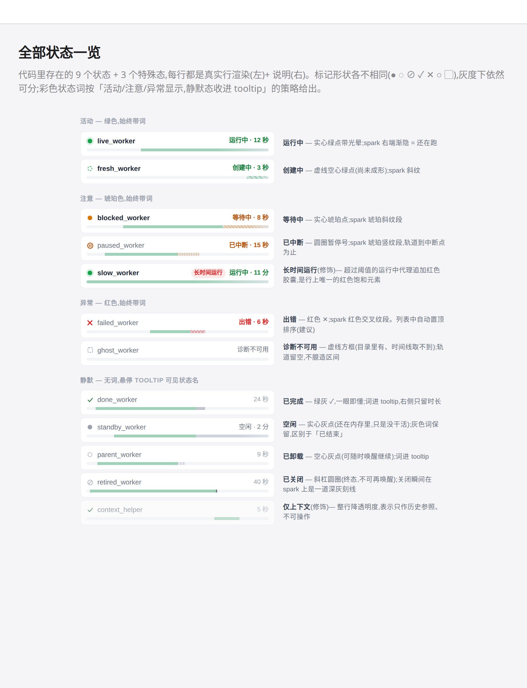
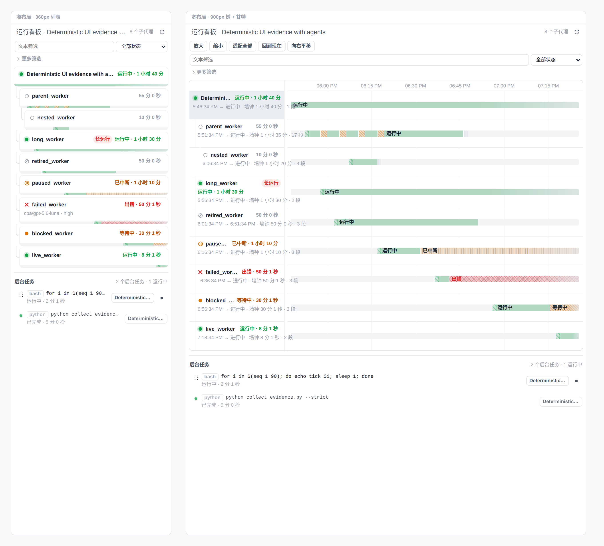
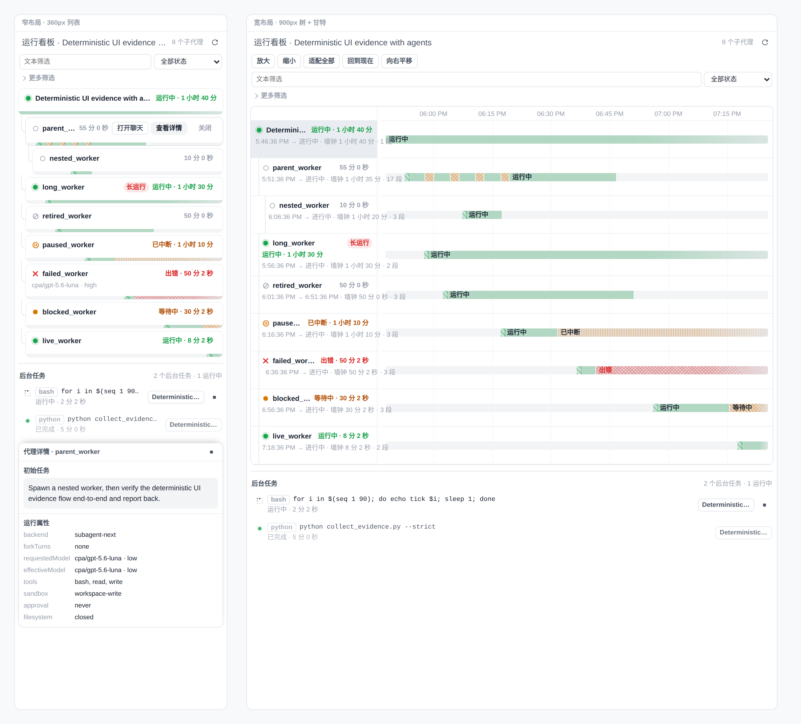

# 运行看板行样式精简与状态呈现设计

> 2026-08-26 · branch `codex/agent-run-dashboard` · 经 Visual Companion 会话逐屏确认

## 目标

运行看板窄布局(列表模式)在多代理时行高失控、视觉噪音大:spark 碎片化成彩色噪点、每行 4 个常驻按钮、meta 行整行重复(`/root/...` 前缀 + 相同 model label)、父子层级几乎不可读。本设计在不损失信息通道(形状/文字/颜色三通道)的前提下压缩行高、提升可扫视性。

## 已确认决策(用户逐项采纳)

1. **Spark 分段合并**:相邻且 `agentStateKind` 相同的分段合并;短于共享量程 ~1% 的碎片并入邻段;spark 尺度下去掉段间 hairline(`buildSegments` 之上加显示层合并 pass,不改数据)。
2. **存在区间底带**:每行 spark 轨道上先铺一条淡色底带标出代理生命窗口(declaredAt → 关闭),空轨道读作「还没出生/已结束」而非「没数据」;共享量程保持不变(跨行可比性保留)。
3. **行动按钮点击显示**(后续修订:hover 展开被用户否决):按钮默认收起,点击行展开、再点收起,同一时间只展开一行;键盘 Tab 进入按钮时 focus-within 同样展开;触屏 tap 行为一致。「已卸载」代理不再渲染永远不可用的「中断」按钮(不可用即不渲染,而非 disabled 占位)。
4. **Meta 行去重**:路径只显示叶子名(全路径进行级 tooltip);model label 与父级相同时省略(收进详情面板)。每行省一整行高度。
5. **卡片缩进 + 连接线**:缩进卡片/行本体并绘制父子连接线,替代原先卡片内部 11px 缩进(层级原先几乎不可读)。

## 状态呈现系统(已确认)

状态压缩为「标记形状 + 分层着色词」两部分;**标记形状各不相同,灰度/色盲下依然可分**,保住原实现的三通道设计意图:

| 层级 | 状态 | 标记 | 状态词 |
| --- | --- | --- | --- |
| 活动(绿) | 运行中 | 实心绿点 + 光晕 | 始终显示,绿色 |
| 活动(绿) | 创建中 | 虚线空心绿点 | 始终显示,绿色 |
| 注意(琥珀) | 等待中 | 实心琥珀点 | 始终显示,琥珀 |
| 注意(琥珀) | 已中断 | 圆圈暂停号 ⊘ | 始终显示,琥珀 |
| 注意(修饰) | 长时间运行 | 运行行 + 红色胶囊 | 胶囊即标识 |
| 异常(红) | 出错 | 红色 ✕ | 始终显示,红色;建议列表置顶 |
| 异常(灰) | 诊断不可用 | 虚线方框 ▢ | 始终显示,灰色;轨道留空不臆造 |
| 静默 | 已完成 | 绿灰 ✓ | 不显示,词进 tooltip,右侧只留时长 |
| 静默 | 空闲 | 实心灰点 | 灰色词保留(live 但没干活,区别于已结束) |
| 静默 | 已卸载 | 空心灰点 | 不显示(可唤醒继续) |
| 静默 | 已关闭 | 斜杠圆圈 | 不显示(终态);关闭瞬间在 spark 上是深灰刻线 |
| 静默(修饰) | 仅上下文 | 整行降透明度 | 不可操作,仅历史参照 |

Spark 纹理沿用现实现的编码:运行=实绿、创建=绿斜纹、等待=琥珀斜纹、中断=琥珀竖纹、出错=红交叉纹、结束态=实心深灰刻线(不再用 1px 竖纹,短桩在 1Hz now-tick 下会闪);进行中分段右端渐隐。

用户确认的完整渲染稿(12 个状态逐行):

## 后续确认(同日)

- **行骨架 = B「精简卡片」**:列表布局中卡片本体缩进(12px/级,连接肘画在卡外)、spark 成为卡片底边(5px,承接卡片圆角)、按钮点击行时出现在标题行内(窄行自动换行到第二行);root 行以字重区分,不再用填充色。
- **「查看详情」面板 = sticky 底部 dock**:与后台任务输出 dock 同一交互模式,且两者**共享一个 dock**(打开一个关闭另一个,job 选中态提升到页面层);header 带代理名。
- 状态词策略维持「活动/注意/异常显示、静默态进 tooltip + sr-only」;meta 的 model 与**全树主流模型**比较(与父级比较在 root 无模型时会全员显示,已否决)。

## 实施记录(同日,本分支)

- `agent-timeline.ts`:新增 `displaySegments()` 显示层合并 pass —— 相邻同类合并、小于量程阈值的碎片并入左邻(errored 与 trailing cold 短桩永不吸收)、后面不再有 live 段的 cold 尾统一截为短桩;错误刻线后不再叠加 cold 短桩。原始 segments 不动,时长/tooltip 用精确值。阈值:spark 1%、canvas 3px/画布宽(放大即恢复细节)。
- `SubagentView.tsx`:`AgentStateBadge` → `AgentStateMark`(每状态独立形状)+ `statusTier`/`statusWordSilent` 分层词;行结构改 B 骨架;行点击切换按钮展开(`openActionsId`,单行互斥,按钮容器阻止冒泡);`baselineModel`(主流模型)去重;不可用的「中断/关闭」不渲染;job 选中态提升 + 详情 dock 移至最后;详情 header 带代理名。
- `SubagentView.module.css`:标记/状态文本/底带/卡片缩进/连接肘/spark 底边/点击展开按钮(`data-actions-open` + focus-within;max-width+max-height 双收起,避免 0 宽 wrap 竖排撑高行)/sticky 详情 dock。
- **顺手修复宿主 bug**:`.runDashboardLane` 改 flex 布局 —— 原 `laneBars` 的 `margin: 12px` 从 lane 顶部外边距塌陷逃逸,宽布局甘特每行累积 +12px 漂移(9 行漂移整整一行),Playwright 实测 drift 全 0。
- 验证:vitest 698 通过(4 个断言更新到新规格)、`tsc` 干净、`pnpm build` 通过;Playwright 对 vite harness(`.coding/visual-companion/harness/`,双布局 + 全状态 + docks)截图核对。

实施后(窄 360px 列表 + 宽 900px 树-甘特,同一数据):

点击行展开按钮 + 详情 dock(cold 代理无「中断」,header 带代理名):

## 剩余次级项(未实施)

首轮评审提出、未逐项确认:后台任务 owner chip 仅在 owner ≠ root 时显示、确认态按钮预留宽度防跳动、少行数时隐藏筛选栏、`treegrid` cell 语义、grid 工具栏图标化。语义色冲突已部分解决(root 行不再用 `interactive-bg-active`)。

## 过程工件

- Visual Companion 会话屏幕(现状还原 / 优化对比 / 骨架方向 / 全状态画廊):`.coding/visual-companion/3828099-1787794247/content/`(私有过程数据,不入库)。
- 视觉验证 harness(vite + 真实 `SubagentView` + mock 端点,双布局并排、全状态、docks):`.coding/visual-companion/harness/`,`node <vite.js> .coding/visual-companion/harness --port 63181` 启动(不入库,不属于任何测试 lane)。
- 本文档截图:`docs/plans/assets/2026-08-26-run-dashboard-*.png`。
